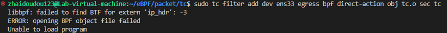
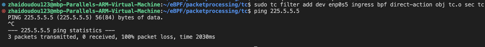

# eBPF网络包处理：实验手册

## 基于eBPF的防火墙

### 一、实验环境

* VMware Workstation Pro
* Ubuntu 22.04

本次实验的相关依赖*应当*与Ubuntu版本无关，但仅保证Ubuntu 22.04可以正常执行，如果遇到问题可以联系助教。 

### 二、准备工作

1.  安装相关依赖  
 
    在终端执行以下命令：  

    ```shell
    sudo apt install clang llvm libelf-dev libbpf-dev libpcap-dev gcc-multilib build-essential linux-tools-$(uname -r) 
    ```


### 三、实验介绍

1.  实验简述

    上上周我们利用内核模块实现了一个简单的防火墙，本次实验中，我们会利用eBPF来实现相同的目标，包括：  
    * 基于eBPF/TC，屏蔽由223.5.5.5发送的数据包
    * 基于eBPF/XDP，屏蔽由223.5.5.5发送的数据包


2.  实验思路

    与内核模块的实验类似，eBPF下的思路如下：
    1. 分析与网络数据相关的xdp_md或__sk_buff结构体
    2. 判断相应结构体数据是否满足需求，并返回对应的响应参数


### 四、开始实验

1.  解析器函数parser  
    在内核模块中，我们使用了内核提供的`ip_hdr()`函数来对sk_buff结构体进行解析，同时取出IP报文的头部。  
    但在eBPF中，由于eBPF虚拟机的存在以及内核安全性的要求等，我们没有办法直接调用`ip_hdr()`函数来提取IP头部，如果强行使用，可以正常编译，但在尝试加载时会报错：
      
    幸运的是，XDP项目在其教程xdp-tutorial中提供了一个现成的parser库`parsing_helper.c`，我们可以直接调用。  
    我们以IP头部的解析器`parse_iphdr`为例来简要介绍：  
    ```c
    /* Header cursor to keep track of current parsing position */
    struct hdr_cursor {
        void *pos;
    };


    static __always_inline int parse_iphdr(struct hdr_cursor *nh,
				       void *data_end,
				       struct iphdr **iphdr)
    {
        struct iphdr *iph = nh->pos;
        int hdrsize;

        if (iph + 1 > data_end)
            return -1;

        hdrsize = iph->ihl * 4;
        /* Sanity check packet field is valid */
        if(hdrsize < sizeof(*iph))
            return -1;

        /* Variable-length IPv4 header, need to use byte-based arithmetic */
        if (nh->pos + hdrsize > data_end)
            return -1;

        nh->pos += hdrsize;
        *iphdr = iph;

        return iph->protocol;
    }
    ```
    该函数的输入为三个指针，`nh`为一个结构体`hdr_cursor`的指针，该结构体中的`pos`对象用于追踪在`xdp_md`或`__sk_buff`结构体中当前解析的位置，`data_end`是指向`xdp_md`或`__sk_buff`结构体的尾部的指针，`iphdr`指针指向解析后的IP头部。  
    具体步骤如下：
    1. 首先，检查`nh->pos`是否指向一个有效的IP报文头部，如果不是，返回`-1`。  
    这里利用了C语言的一个语法糖，结构体+1代表指针向后移动一整个结构体。如果此时的指针位置大于`data_end`则意味着中间不存在IP头部，返回`-1`。  
    2. 然后，计算IP报文头部的大小，因为它可能有可选字段。大小等于`iph->ihl`乘以四，其中`iph->ihl`表示报文头部的长度（以32位为单位）。  
    接着，检查`nh->pos`加上报文头部的大小是否超过了`data_end`，如果是，则意味着不存在有效的IP头部，返回`-1`。  
    3. 最后，将`nh->pos`向后移动报文头部的大小，将`iph`赋值给`*iphdr`，返回`iph->protocol`表示IP报文的协议字段。

    下一节中我们将介绍对应的eBPF程序如何调用这个解析函数。

2.  核心代码编写  
    本节主要以TC为例，并在注释中给出XDP的实现。
    ```c
    /* A eBPF/TC firewall to block packets from 223.5.5.5 */
    int droppacket(struct __sk_buff *skb){ // XDP: int droppacket(struct xdp_md *ctx){
        
        void *data_end = (void *)(long)skb->data_end;
        void *data = (void *)(long)skb->data;
        /* For XDP, just replace skb with ctx */
        struct hdr_cursor nh;
        struct ethhdr *eth;
        int eth_type;
        int ip_type;
        struct iphdr *iphdr;


        /* These keep track of the next header type and iterator pointer */
        nh.pos = data;
        /* Parse Ethernet */
        eth_type = parse_ethhdr(&nh, data_end, &eth);
        if (eth_type != bpf_htons(ETH_P_IP))
        return TC_ACT_OK; // XDP: return XDP_PASS;
            
        /* Parse IP headers */
        ip_type = parse_iphdr(&nh, data_end, &iphdr);
        if (ip_type == -1)
        return TC_ACT_OK; 

        if(iphdr->saddr == 0x050505DF){ // 223.5.5.5's hex, Big-endian mode.
            // drop the packet
            return TC_ACT_SHOT; // XDP: return XDP_DROP;
            }
        return TC_ACT_OK; 
    }
    ```
    在该代码中，我们通过`nh`结构体中的`pos`对象跟踪网络数据处理位置，并依次调用以太网帧、IP报文的解析器，并根据结果返回响应。如果某个包从223.5.5.5发来，就丢弃它，反之让其通过。
    完整代码见本文末尾。
3.  编译与加载  
    在编写代码完成后，我们需要将其编译成为可以加载至系统内核的eBPF对象文件，并在终端中执行相关命令进行加载。  
    1.  编译   
        在终端中执行如下命令进行编译：
        ```shell
        clang -O2 -target bpf -c tc.c -o tc.o
        ```
    2.  TC程序的加载与卸载  
        加载：
        ```shell
        # 网卡接口需要自行通过ip a命令查看
        sudo tc qdisc add dev ens33 clsact
        sudo tc filter add dev ens33 egress bpf direct-action obj tc.o sec tc
        ```
        卸载：
        ```shell
        sudo tc qdisc del dev ens33 clsact
        ```
    3.  XDP程序的加载与卸载  
        加载：
        ```shell
        # 网卡接口需要自行通过ip a命令查看
        sudo ip link set dev ens33 xdp obj xdp.o sec xdp
        ```
        卸载：
        ```shell
        sudo ip link set dev ens33 xdp off
        ```     
    
### 五、实验结果
两个实验的结果是一致的，在此只展示eBPF/TC的结果：  
  

### 六、参考资料及建议

* XDP-tutorial  
<https://github.com/xdp-project/xdp-tutorial>  
    

### 七、新尝试
之前的内核模块课上的额外实验中，我们对ICMP协议以及本机发出的目标为223.5.5.5数据包进行了屏蔽，在eBPF下我们同样也可以做到这件事，只需要修改`iph->saddr`为`iph->daddr`即可。需要注意的是，对于流出方向的数据包，只有eBPF/TC可以进行相关的操作，XDP做不到。  

而本周的新尝试是，实现一个针对特定端口的防火墙。  
例如，ssh服务的端口号是`22`，且使用TCP协议。我们的目标是屏蔽一切目标端口为`22`的TCP报文。

*提示*  
1. 协议的判断可以通过判断`iph->protocol`是否为`IPPROTO_TCP`实现，记得首先`#include <linux/in.h>`。  
2. 先利用`parse_tcphdr()`函数解析TCP头部后再进行端口判断，该函数定义在`parsing_helpers.h`头文件中，返回值为`int`类型，值为TCP头部中储存的TCP头部长度。
3. 端口由`tcphdr`结构体的`dest`或`source`对象决定，本次只需要针对流入流量处理即可，所以选择`dest`对象，即指向本机的目标端口。具体用法为`tcphdr->dest`。另外，端口号为大段顺序的16位整数，`22`对应的大段十六进制端口号为`0x1600`。


### 八、代码附录
1.  `tc.c`
    ```c
    /* SPDX-License-Identifier: GPL-2.0 */
    #include <linux/bpf.h>
    #include <linux/pkt_cls.h>  
    #include "bpf/bpf_helpers.h"
    #include "bpf/bpf_endian.h"
    #include "parsing_helpers.h"


    SEC("tc")
    int droppacket(struct __sk_buff *skb){
        void *data_end = (void *)(long)skb->data_end;
        void *data = (void *)(long)skb->data;
        struct hdr_cursor nh;
        struct ethhdr *eth;
        int eth_type;
        int ip_type;
        struct iphdr *iphdr;


        /* These keep track of the next header type and iterator pointer */
        nh.pos = data;
        /* Parse Ethernet */
        eth_type = parse_ethhdr(&nh, data_end, &eth);
        if (eth_type != bpf_htons(ETH_P_IP)) return TC_ACT_OK;
            
        /* Parse IP/IPv6 headers */
        ip_type = parse_iphdr(&nh, data_end, &iphdr);
        if (ip_type == -1) return TC_ACT_OK;

        if (iphdr->saddr == 0x050505DF){ // 223.5.5.5's hex, Big-endian mode.
            // drop the packet
            return TC_ACT_SHOT;
            }
        return TC_ACT_OK; 
    }
    char _license[] SEC("license") = "GPL";
    ```
2.  `xdp.c`
    ```c
    /* SPDX-License-Identifier: GPL-2.0 */
    #include <linux/bpf.h>
    #include "bpf/bpf_helpers.h"
    #include "bpf/bpf_endian.h"
    #include "parsing_helpers.h"


    SEC("xdp")
    int droppacket(struct xdp_md *ctx){
        void *data_end = (void *)(long)ctx->data_end;
        void *data = (void *)(long)ctx->data;
        struct hdr_cursor nh;
        struct ethhdr *eth;
        int eth_type;
        int ip_type;
        struct iphdr *iphdr;


        /* These keep track of the next header type and iterator pointer */
        nh.pos = data;
        /* Parse Ethernet */
        eth_type = parse_ethhdr(&nh, data_end, &eth);
        if (eth_type != bpf_htons(ETH_P_IP)) return XDP_PASS;
            
        /* Parse IP/IPv6 headers */
        ip_type = parse_iphdr(&nh, data_end, &iphdr);
        if (ip_type == -1) return XDP_PASS;

        if (iphdr->saddr == 0x050505DF){ // 223.5.5.5's hex, Big-endian mode.
            // drop the packet
            return XDP_DROP;
        }
        return XDP_PASS; 
    }
    char _license[] SEC("license") = "GPL";
    ```

3.  `parsing_helpers.h`  
    需要放在与`tc.c`、`xdp.c`相同的目录下
    该文件包括了以太网、IPv4/v6、TCP/UDP、ICMP、VLAN tag以及VXLAN等协议的解析器

    ```c
    /* SPDX-License-Identifier: (GPL-2.0-or-later OR BSD-2-clause) */
    /*
    * This file contains parsing functions that are used in the packetXX XDP
    * programs. The functions are marked as __always_inline, and fully defined in
    * this header file to be included in the BPF program.
    *
    * Each helper parses a packet header, including doing bounds checking, and
    * returns the type of its contents if successful, and -1 otherwise.
    *
    * For Ethernet and IP headers, the content type is the type of the payload
    * (h_proto for Ethernet, nexthdr for IPv6), for ICMP it is the ICMP type field.
    * All return values are in host byte order.
    *
    * The versions of the functions included here are slightly expanded versions of
    * the functions in the packet01 lesson. For instance, the Ethernet header
    * parsing has support for parsing VLAN tags.
    */

    #ifndef __PARSING_HELPERS_H
    #define __PARSING_HELPERS_H

    #include <stddef.h>
    #include <linux/if_ether.h>
    #include <linux/if_packet.h>
    #include <linux/ip.h>
    #include <linux/ipv6.h>
    #include <linux/icmp.h>
    #include <linux/icmpv6.h>
    #include <linux/udp.h>
    #include <linux/tcp.h>

    /* Header cursor to keep track of current parsing position */
    struct hdr_cursor {
        void *pos;
    };

    /*
    *	struct vlan_hdr - vlan header
    *	@h_vlan_TCI: priority and VLAN ID
    *	@h_vlan_encapsulated_proto: packet type ID or len
    */
    struct vlan_hdr {
        __be16	h_vlan_TCI;
        __be16	h_vlan_encapsulated_proto;
    };

    /* VXLAN protocol (RFC 7348) header:
    * +-+-+-+-+-+-+-+-+-+-+-+-+-+-+-+-+-+-+-+-+-+-+-+-+-+-+-+-+-+-+-+-+
    * |R|R|R|R|I|R|R|R|               Reserved                        |
    * +-+-+-+-+-+-+-+-+-+-+-+-+-+-+-+-+-+-+-+-+-+-+-+-+-+-+-+-+-+-+-+-+
    * |                VXLAN Network Identifier (VNI) |   Reserved    |
    * +-+-+-+-+-+-+-+-+-+-+-+-+-+-+-+-+-+-+-+-+-+-+-+-+-+-+-+-+-+-+-+-+
    *
    * I = VXLAN Network Identifier (VNI) present.
    */
    struct vxlanhdr {
        __be32 vx_flags;
        __be32 vx_vni;
    };

    /*
    * Struct icmphdr_common represents the common part of the icmphdr and icmp6hdr
    * structures.
    */
    struct icmphdr_common {
        __u8		type;
        __u8		code;
        __sum16	cksum;
    };

    /* Allow users of header file to redefine VLAN max depth */
    #ifndef VLAN_MAX_DEPTH
    #define VLAN_MAX_DEPTH 2
    #endif

    #define VLAN_VID_MASK		0x0fff /* VLAN Identifier */
    /* Struct for collecting VLANs after parsing via parse_ethhdr_vlan */
    struct collect_vlans {
        __u16 id[VLAN_MAX_DEPTH];
    };

    static __always_inline int proto_is_vlan(__u16 h_proto)
    {
        return !!(h_proto == bpf_htons(ETH_P_8021Q) ||
            h_proto == bpf_htons(ETH_P_8021AD));
    }

    /* Notice, parse_ethhdr() will skip VLAN tags, by advancing nh->pos and returns
    * next header EtherType, BUT the ethhdr pointer supplied still points to the
    * Ethernet header. Thus, caller can look at eth->h_proto to see if this was a
    * VLAN tagged packet.
    */
    static __always_inline int parse_ethhdr_vlan(struct hdr_cursor *nh,
                            void *data_end,
                            struct ethhdr **ethhdr,
                            struct collect_vlans *vlans)
    {
        struct ethhdr *eth = nh->pos;
        int hdrsize = sizeof(*eth);
        struct vlan_hdr *vlh;
        __u16 h_proto;
        int i;

        /* Byte-count bounds check; check if current pointer + size of header
        * is after data_end.
        */
        if (nh->pos + hdrsize > data_end)
            return -1;

        nh->pos += hdrsize;
        *ethhdr = eth;
        vlh = nh->pos;
        h_proto = eth->h_proto;

        /* Use loop unrolling to avoid the verifier restriction on loops;
        * support up to VLAN_MAX_DEPTH layers of VLAN encapsulation.
        */
        #pragma unroll
        for (i = 0; i < VLAN_MAX_DEPTH; i++) {
            if (!proto_is_vlan(h_proto))
                break;

            if (vlh + 1 > data_end)
                break;

            h_proto = vlh->h_vlan_encapsulated_proto;
            if (vlans) /* collect VLAN ids */
                vlans->id[i] =
                    (bpf_ntohs(vlh->h_vlan_TCI) & VLAN_VID_MASK);

            vlh++;
        }

        nh->pos = vlh;
        return h_proto; /* network-byte-order */
    }

    static __always_inline int parse_ethhdr(struct hdr_cursor *nh,
                        void *data_end,
                        struct ethhdr **ethhdr)
    {
        /* Expect compiler removes the code that collects VLAN ids */
        return parse_ethhdr_vlan(nh, data_end, ethhdr, NULL);
    }

    static __always_inline int parse_ip6hdr(struct hdr_cursor *nh,
                        void *data_end,
                        struct ipv6hdr **ip6hdr)
    {
        struct ipv6hdr *ip6h = nh->pos;

        /* Pointer-arithmetic bounds check; pointer +1 points to after end of
        * thing being pointed to. We will be using this style in the remainder
        * of the tutorial.
        */
        if (ip6h + 1 > data_end)
            return -1;

        nh->pos = ip6h + 1;
        *ip6hdr = ip6h;

        return ip6h->nexthdr;
    }

    static __always_inline int parse_iphdr(struct hdr_cursor *nh,
                        void *data_end,
                        struct iphdr **iphdr)
    {
        struct iphdr *iph = nh->pos;
        int hdrsize;

        if (iph + 1 > data_end)
            return -1;

        hdrsize = iph->ihl * 4;
        /* Sanity check packet field is valid */
        if(hdrsize < sizeof(*iph))
            return -1;

        /* Variable-length IPv4 header, need to use byte-based arithmetic */
        if (nh->pos + hdrsize > data_end)
            return -1;

        nh->pos += hdrsize;
        *iphdr = iph;

        return iph->protocol;
    }

    static __always_inline int parse_icmp6hdr(struct hdr_cursor *nh,
                        void *data_end,
                        struct icmp6hdr **icmp6hdr)
    {
        struct icmp6hdr *icmp6h = nh->pos;

        if (icmp6h + 1 > data_end)
            return -1;

        nh->pos   = icmp6h + 1;
        *icmp6hdr = icmp6h;

        return icmp6h->icmp6_type;
    }

    static __always_inline int parse_icmphdr(struct hdr_cursor *nh,
                        void *data_end,
                        struct icmphdr **icmphdr)
    {
        struct icmphdr *icmph = nh->pos;

        if (icmph + 1 > data_end)
            return -1;

        nh->pos  = icmph + 1;
        *icmphdr = icmph;

        return icmph->type;
    }

    static __always_inline int parse_icmphdr_common(struct hdr_cursor *nh,
                            void *data_end,
                            struct icmphdr_common **icmphdr)
    {
        struct icmphdr_common *h = nh->pos;

        if (h + 1 > data_end)
            return -1;

        nh->pos  = h + 1;
        *icmphdr = h;

        return h->type;
    }

    /*
    * parse_vxlanhdr: parse the vxlan header and return the VNI of the udp payload
    */
    static __always_inline int parse_vxlanhdr(struct hdr_cursor *nh,
                        void *data_end,
                        struct vxlanhdr **vxlanhdr)
    {
        // int len;
        struct vxlanhdr *h = nh->pos;

        if (h + 1 > data_end)
            return -1;

        nh->pos  = h + 1;
        *vxlanhdr = h;
        // if ((h->vx_flags & (0b00000000000000000000000000010000))!=0b00000000000000000000000000010000)
        // 	return -1;
        
        return h->vx_vni;
    }

    /*
    * parse_udphdr: parse the udp header and return the length of the udp payload
    */
    static __always_inline int parse_udphdr(struct hdr_cursor *nh,
                        void *data_end,
                        struct udphdr **udphdr)
    {
        int len;
        struct udphdr *h = nh->pos;

        if (h + 1 > data_end)
            return -1;

        nh->pos  = h + 1;
        *udphdr = h;

        len = bpf_ntohs(h->len) - sizeof(struct udphdr);
        if (len < 0)
            return -1;

        return len;
    }


    /*
    * parse_tcphdr: parse and return the length of the tcp header
    */
    static __always_inline int parse_tcphdr(struct hdr_cursor *nh,
                        void *data_end,
                        struct tcphdr **tcphdr)
    {
        int len;
        struct tcphdr *h = nh->pos;

        if (h + 1 > data_end)
            return -1;

        len = h->doff * 4;
        /* Sanity check packet field is valid */
        if(len < sizeof(*h))
            return -1;

        /* Variable-length TCP header, need to use byte-based arithmetic */
        if (nh->pos + len > data_end)
            return -1;

        nh->pos += len;
        *tcphdr = h;

        return len;
    }

    #endif /* __PARSING_HELPERS_H */

    ```
