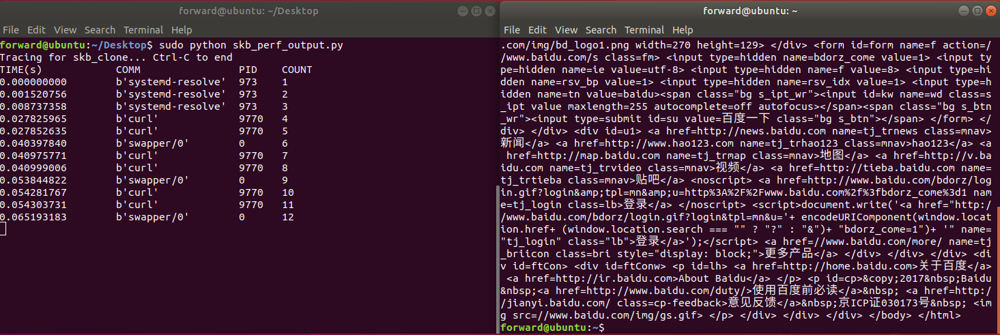

# 实验手册

## skb_clone()监测

### 一、实验环境

* VMware Workstation Pro
* Ubuntu 22.04

### 二、BCC安装

采用源码编译的安装方式

1. 更换国内镜像源（可选）
   编辑sources.list文件

    `sudo vim /etc/apt/sources.list`

    配置内容如下：

    ```shell
    # 默认注释了源码仓库，如有需要可自行取消注释
    deb https://mirrors.ustc.edu.cn/ubuntu/ jammy main restricted universe multiverse
    # deb-src https://mirrors.ustc.edu.cn/ubuntu/ jammy main restricted universe multiverse

    deb https://mirrors.ustc.edu.cn/ubuntu/ jammy-security main restricted universe multiverse
    # deb-src https://mirrors.ustc.edu.cn/ubuntu/ jammy-security main restricted universe multiverse

    deb https://mirrors.ustc.edu.cn/ubuntu/ jammy-updates main restricted universe multiverse
    # deb-src https://mirrors.ustc.edu.cn/ubuntu/ jammy-updates main restricted universe multiverse

    deb https://mirrors.ustc.edu.cn/ubuntu/ jammy-backports main restricted universe multiverse
    # deb-src https://mirrors.ustc.edu.cn/ubuntu/ jammy-backports main restricted universe multiverse

    # 预发布软件源，不建议启用
    # deb https://mirrors.ustc.edu.cn/ubuntu/ jammy-proposed main restricted universe multiverse
    # deb-src https://mirrors.ustc.edu.cn/ubuntu/ jammy-proposed main restricted universe multiverse
    ```
    <br/>
    <br/>

    再更新软件列表以及软件包

    ```shell
    sudo apt-get update
    sudo apt-get upgrade
    ```

2. 安装相关依赖

    要从源码构建工具链，需要：

    * LLVM 3.7.1或者更高，编译时支持BPF(默认为on)
    * Clang，由与LLVM相同的树构建
    * cmake(>=3.1), gcc(>=4.7), flex, bison
    * LuaJIT, 如果需要Lua

    在终端执行以下命令：

    ```shell
    sudo apt install -y bison build-essential cmake flex git libedit-dev \
    libllvm14 llvm-14-dev libclang-14-dev python3 zlib1g-dev libelf-dev libfl-dev python3-setuptools
    ```
    对于其他版本的Ubuntu，可以参考 https://github.com/iovisor/bcc/blob/master/INSTALL.md#ubuntu---source

    顺便安装一下后面要用到的`curl`：
    ```
    apt install curl
    ```

3. 安装编译BCC

    在终端依序执行以下命令：
    ```shell
    git clone https://github.com/iovisor/bcc.git
    mkdir bcc/build; cd bcc/build
    cmake ..
    make
    sudo make install
    cmake -DPYTHON_CMD=python3 ..
    pushd src/python/
    make
    sudo make install
    popd
    ```

    

    至此BCC安装完成。

    注意修改python软链接指向python3，即可直接使用/usr/share/bcc/tools中的现有工具。

    ```
    cd /usr/bin
    sudo ln -s python3 python
    ```

    例如执行funccount工具，进行简单监测，验证安装成功。

    

### 三、skb_clone实验

1. 实验要求

   本机用curl请求一个网上的文件，用bcc测量一下这个过程中skb_clone()这个函数被调用的次数以及调用的进程id。

2. 实验思路

    要实现上述实验要求，需要关注以下三点任务。

    2.1. 使用kprobe对内核进行动态tracing

    ```python
    from bcc import BPF
    
    BPF(text = """
    #C语言代码段
    """)
    
    #对bpf的处理代码
    ```

    根据BPF程序结构，bcc有如下两种写法：

    * C函数以`kprobe__`开头，其余部分被视为要监测的内核函数名，如`kprobe__skb_clone()`
    * C函数为自定义函数，利用`b.attach_kprobe(event=("func_1"), fn_name="func_2")`建立

    kprobe，内核系统出现func_1操作时执行func_2函数，即自定义函数。

    2.2. 获取调用skb_clone()函数的进程id

    提供如下两种思路：

    * 从`trace_fields()`中获取诸如pid和时间戳的信息
    * 使用`BPF_PERF_OUTPUT()`接口

    2.3. 记录skb_clone()函数的调用次数

    需要用变量count记录次数，实现count的更新累加，并能返回给用户态。

    利用BPF map对象，实现用户态和内核态的数据交互，这里使用BPF_HASH。

3. 实验过程

    根据两种获取信息的思路，提供两种编写方式：

    3.1. `trace_fields()`

    核心代码如下：

    ```c
    #include <uapi/linux/ptrace.h>
    
    //创建一个BPF map对象
    BPF_HASH(count);
    
    //出现skb_clone操作时执行以下函数，记录次数
    int do_trace(struct pt_regs *ctx){
        u64 cur_count = 1, key = 0;
        u64 *cur_ptr;
        cur_ptr = count.lookup(&key);
        if (cur_ptr == NULL){
    
            count.update(&key, &cur_count);
            bpf_trace_printk("%d\\n", cur_count);
    
        }else{
    
            cur_count = *cur_ptr + 1;
            count.update(&key, &cur_count);
            bpf_trace_printk("%d\\n", cur_count);
    
            }
        return 0;
    }
    ```

    其中，

    * `count.lookup(&key)`：查看hash中key对应的值，如果存在返回值的指针
    * ` count.update(&key, &cur_count)`：将value与key关联，并覆盖之前的value，即更新次数
    * `bpf_trace_printk()`：打印的信息会由`trace_fields()`中的`msg`字段取得

    当出现skb_clone()操作时，就会执行do_trace()函数，用变量cur_count记录次数。

    每出现一次skb_clone()操作时，`cur_ptr = count.lookup(&key)`就会查看hash中key对应的值，返回值的指针，`cur_count = *cur_ptr + 1`即可更新cur_count数值，并通过hash：`count.update(&key, &cur_count)`实现次数的更新覆盖。

    最后，输出相关信息即可。
    <br/>
    <br/>
    3.2. `BPF_PERF_OUTPUT()`

    该方法的逻辑思路一致，区别在于不再从`trace_fields()`中获取信息。

    需要自己定义C struct，将data从kernel传到user space。

    ```C
    struct data_t{
        u32 pid;
        u64 ts;
        u64 cur_count;
        char comm[TASK_COMM_LEN];
    };
    ```

    我们选择记录pid、时间戳、次数以及进程名，通过相应bpf函数获取。

    获取并计算得出相应数据后，通过`        events.perf_submit(ctx, &data, sizeof(data))`提交，使得user space能够通过per ring buffer读取。

    输出信息部分代码如下：

    ```python
    start = 0
    def print_event(cpu, data, size):
        global start
        event = b["events"].event(data)  #获取由bpf函数perf_submit输出的数据
        if start == 0:
            start = event.ts
        time_s = (float(event.ts-start)) / 1000000000
        print("%-18.9f %-19s %-6d %d"%(time_s, event.comm, event.pid, event.cur_count))
    
    #打开perf缓冲区，并指定一个回调函数，当有数据时，自动使用该函数处理
    b["events"].open_perf_buffer(print_event)
    while True:
        try:
            b.perf_buffer_poll()  #等待perf缓冲区内容
        except  KeyboardInterrupt:
            exit()
    ```

**全部示例代码参考附录**。

### 四、skb_clone实验结果

以`curl www.baidu.com`为例，监测`skb_clone()`的调用情况。

1. `trace_fields`


2. `BPF_PERF_OUTPUT()`



示例中两种方法测出的调用次数为12，可以多次测量观察差别。

不同版本、不同环境下会有不同，可以根据具体情况、结合输出内容深入分析相应网络行为。

### 五、参考资料及建议

* bcc仓库

  https://github.com/iovisor/bcc  
  https://github.com/iovisor/bcc/blob/master/docs/reference_guide.md


* 推荐使用手册中对应版本，版本不一致的可参考仓库中相关资料
### 六、新尝试
在大家的实际操作中，可能会发现：

由于VSCode、SSH等服务的运行，导致调用skb_clone函数的进程数量有很多，我们没有办法准确定位到curl命令。
我们应当尽可能排除这些影响，即，关闭ssh连接、关闭VSCode，选择直接从虚拟机本身的terminal进行测试。  

但是，如果我们只想测试curl自身的函数调用情况，且就是*懒得进虚拟机搞呢？*

我们可以通过上周介绍的`grep`命令筛选出curl命令相关的结果：
```shell
sudo python skb_clone_count.py | grep 'curl'
```
但是，如此运行后有几个问题：

1. 调用次数统计是针对所有进程的，没有办法单独针对curl命令统计
2. 运行速度很慢，在调用函数的进程很多的情况下从curl命令发出到出现结果要过很久

*提示：*  
通过`bpf_get_current_comm()`、`bpf_get_current_pid_tgid()`等函数就可以获取特定进程的进程名、进程PID等。  
具体函数用法如下，且可以参考skb_perf_output.py文件中的使用方法：
```C
char comm[TASK_COMM_LEN];
bpf_get_current_comm(char * COMM, sizeof(COMM)); //将进程名赋给字符数组COMM

u64 pid = bpf_get_current_pid_tgid(); //将进程pid赋给u64变量pid
```

对于当前代码中的哈希表BPF_HASH(count)来说，key定义为0，可以通过将pid设置为key来解决第一个问题。  

而运行速度很慢的原因是因为输出的太多，如果可以控制只输出进程名为curl，即可加速。  
我们的目标主要是实现第一个问题的解决，随后调用`grep`命令即可，慢的问题的解决有一些复杂，因为涉及到内核中如何实现字符串比较的问题，大家如果有兴趣可以课后自己尝试。


### 七、代码附录

1. `skb_clone_count.py`

```python
from __future__ import print_function
from bcc import BPF

b = BPF(text="""
    #include <uapi/linux/ptrace.h>

    BPF_HASH(count);

    int do_trace(struct pt_regs *ctx){
        u64 cur_count = 1, key = 0;
        u64 *cur_ptr;
        cur_ptr = count.lookup(&key);
        if (cur_ptr == NULL){

            count.update(&key, &cur_count);
            bpf_trace_printk("%d\\n", cur_count);

        }else{

            cur_count = *cur_ptr + 1;
            count.update(&key, &cur_count);
            bpf_trace_printk("%d\\n", cur_count);

            }
        return 0;
    }
""")

b.attach_kprobe(event=("skb_clone"), fn_name="do_trace")
print("Tracing for skb_clone... Ctrl-C to end")
print("%-18s %-19s %-6s %s" % ("TIME(s)", "COMM", "PID", "COUNT"))
while True:
    try:
        (task, pid, cpu, flags, ts, msg) = b.trace_fields()
    except KeyboardInterrupt:
        exit()
    print("%-18.9f %-19s %-6d %s" %(ts, task, pid, msg))
```

2. `skb_perf_output.py`

```python
from __future__ import print_function
from bcc import BPF

prog = """

#include <linux/sched.h>
#include <uapi/linux/ptrace.h>

struct data_t{
    u32 pid;
    u64 ts;
    u64 cur_count;
    char comm[TASK_COMM_LEN];
};

BPF_PERF_OUTPUT(events);
BPF_HASH(count);

int do_trace(struct pt_regs *ctx){
    struct data_t data = {};
    
    data.pid = bpf_get_current_pid_tgid();
    data.ts = bpf_ktime_get_ns();
    bpf_get_current_comm(&data.comm, sizeof(data.comm));

    u64 cur_count = 1, key = 0;
    u64 *cur_ptr;
    cur_ptr = count.lookup(&key);

    if (cur_ptr == NULL){

        count.update(&key, &cur_count);
        data.cur_count = cur_count;
        events.perf_submit(ctx, &data, sizeof(data));

    }else{

        cur_count = *cur_ptr + 1;
        count.update(&key, &cur_count);
        data.cur_count = cur_count;
        events.perf_submit(ctx, &data, sizeof(data));

        }
    return 0;
}
"""

b = BPF(text = prog)
b.attach_kprobe(event = "skb_clone", fn_name="do_trace")
print("Tracing for skb_clone... Ctrl-C to end")
print("%-18s %-19s %-6s %s" % ("TIME(s)", "COMM", "PID", "COUNT"))

start = 0
def print_event(cpu, data, size):
    global start
    event = b["events"].event(data)
    if start == 0:
        start = event.ts
    time_s = (float(event.ts-start)) / 1000000000
    print("%-18.9f %-19s %-6d %d" % (time_s, event.comm, event.pid, event.cur_count))

b["events"].open_perf_buffer(print_event)
while True:
    try:
        b.perf_buffer_poll()
    except  KeyboardInterrupt:
        exit()
```

