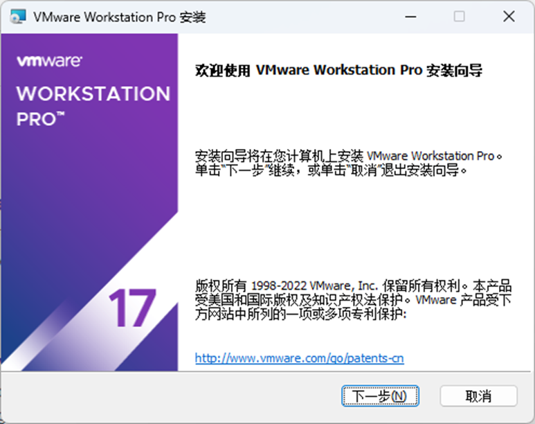
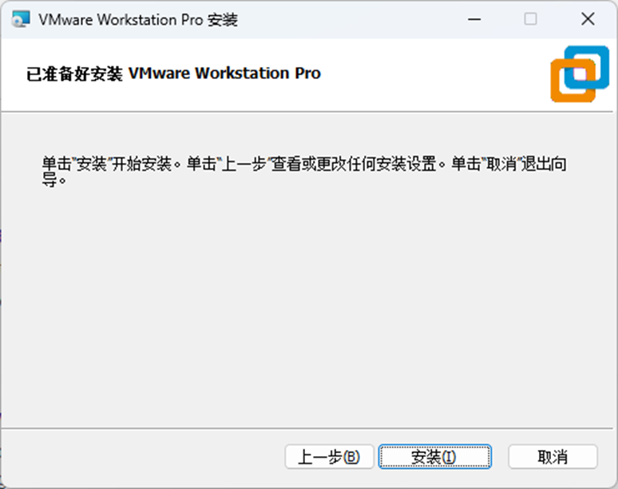

# 数据中心网络——实验手册1：Linux 内核模块开发教程

---

## 内核即内心

在 Linux 系统中，**内核（kernel）** 就像是操作系统的“内心”。

如果我们希望在 Linux 内核中进行一些开发，最方便的方式是编写 **内核模块（kernel module）**，而不是直接修改 Linux 内核源码并重新编译。

本教程将展示如何编写简单的内核模块，并将其加载进内核中。

---

## 一、环境准备

在编码之前，我们需要先配置 Linux 开发环境。

对于非 Linux 用户，最简单的方法是使用虚拟机。推荐使用如下工具：

- Windows 用户：**VMware Workstation Pro**
- macOS 用户：**Parallels Desktop** 或 **VMware Fusion**

下载地址：
- VMware Workstation Pro / VMWare Fusion：https://www.vmware.com/products/desktop-hypervisor/workstation-and-fusion
- Parallels Desktop：https://www.parallels.cn/products/desktop/trial/

---

### 安装 VMware Workstation Pro

1. 一路点击“下一步”；  


2. 最后点击“安装”。  


---

### 配置 Linux 虚拟机

本教程使用 **Ubuntu 22.04 LTS** 作为开发环境操作系统。

首先下载安装镜像：
- x86 版本镜像：https://releases.ubuntu.com/jammy/ubuntu-22.04.5-desktop-amd64.iso
- ARM版本镜像：https://ftpmirror.your.org/pub/ubuntu/cdimage/jammy/daily-live/20230826/jammy-desktop-arm64.iso

---

### 在 VMware 中创建虚拟机

1. 打开 VMware Workstation；
2. 点击 “创建新的虚拟机”；  

3. 选择安装镜像文件继续配置；  

4. 设置用户名、密码及虚拟机名称；

5. 设置磁盘大小（推荐 30GB，可后续扩展）；其他参数如内存、网卡等可后续调整。

---

### 安装 Ubuntu 系统

- 选择键盘布局为 English(US)；
- 选择Erase disk and install Ubuntu；
- 时区选择上海；
- 若提示，重新设置用户名和密码。

---

### 获取虚拟机 IP 地址

1. 首先确认虚拟机网络为NAT模式。


2. 打开 Ubuntu 终端，输入以下命令获取虚拟机的 IP 地址：

```bash
ip a
```


---

### 安装 SSH 和 VMware Tools

1. 更新软件源：

    ```bash
    sudo apt-get update
    ```

2. 安装 SSH 服务：

    ```bash
    sudo apt-get install openssh-server
    ```

3. 安装 VMware Tools：

    ```bash
    sudo apt-get install open-vm-tools open-vm-tools-desktop open-vm-tools-dkms
    ```

4. 回到主机，使用 SSH 工具（如 Termius 或 Windows Terminal）连接虚拟机：

    ```bash
    ssh 用户名@虚拟机IP
    ```


Termius下载链接：https://termius.com/

---

### 安装内核模块开发所需依赖

使用以下命令安装构建内核模块所需的软件包：

```bash
sudo apt-get install build-essential linux-headers-`uname -r`
```

现在，你已经成功搭建好用于内核模块开发的 Linux 环境！

---


## 二、基本的Linux命令教程

### 选择你喜欢的编辑器或 IDE：

- **VSCode（推荐远程开发）**
- Ubuntu 自带的 **VIM** 或 **nano**
- 图形化 IDE：**CLion** 或 **Visual Studio**

一些有用的链接：

- VSCode（远程开发指南）: https://zhuanlan.zhihu.com/p/141205262
- VIM 教程：https://www.runoob.com/linux/linux-vim.html
- nano 简介：https://cloud.tencent.com/developer/article/1187038

本文将使用 VIM 作为编辑器进行演示。

---

### 基本 Linux 命令
SSH 连接到虚拟机后，你现在位于用户主目录。  


以下是一些常用命令：

- 新建模块目录：

    ```bash
    mkdir mymodule
    ```

- 查看目录内容：

    ```bash
    ls
    ```

- 进入模块目录：

    ```bash
    cd mymodule
    ```


---

### 使用 VIM 编写代码

若你选择使用 VIM，可以按照以下步骤操作：

1. 安装完整版 VIM：

    ```bash
    sudo apt-get remove vim-common
    sudo apt-get install vim
    ```

2. 创建并编辑 C 文件：

    ```bash
    vi mymodule.c
    ```

3. 输入模式下输入代码（按 `i` 键进入插入模式）；
4. 按 `ESC` 键退出插入模式，输入 `:wq` 保存退出；
   - 输入 `:q!` 可强制退出不保存。

  

---

### 编译并运行测试代码

使用如下命令编译并运行你的 Hello World 测试程序（非内核模块）：

```bash
gcc mymodule.c
./a.out
```

> 之后的讲解中我们将不再赘述编辑器与基本 Linux 命令的使用，以节省时间。

## 三、一个简单的内核模块

终于到了编码部分。我们从一个最简单的 `Hello World` 内核模块开始。

---

### helloworld.c

以下是 `helloworld.c` 的源代码：

```c
#include <linux/init.h>
#include <linux/module.h>
#include <linux/kernel.h>

MODULE_LICENSE("GPL");
MODULE_AUTHOR("Yi");
MODULE_DESCRIPTION("A simple hello world module.");
MODULE_VERSION("0.01");

static int __init hello_world_init(void) {
    printk(KERN_INFO "Hello, World!\n");
    return 0;
}

static void __exit hello_world_exit(void) {
    printk(KERN_INFO "Goodbye, World!\n");
}

module_init(hello_world_init);
module_exit(hello_world_exit);
```

---

### Makefile

我们使用 `make` 来编译内核模块。以下是 `Makefile` 内容：

```makefile
obj-m += helloworld.o

all:
	make -C /lib/modules/$(shell uname -r)/build M=$(PWD) modules

clean:
	make -C /lib/modules/$(shell uname -r)/build M=$(PWD) clean
```

> 参数说明：
>
> - `-C`：指定内核头文件路径；
> - `M=$(PWD)`：指定当前模块所在目录；
> - `modules`：生成内核模块；
> - `clean`：清理构建过程文件。

---

### 编译与加载模块

1. 使用 `make` 编译模块，生成 `helloworld.ko`。


2. 使用以下命令加载模块：

    ```bash
    sudo insmod helloworld.ko
    ```


3. 使用 `dmesg` 查看模块输出：

    ```bash
    sudo dmesg
    ```

---

### 查看与卸载模块

查看是否加载成功：

```bash
sudo lsmod | grep helloworld
```


卸载模块：

```bash
sudo rmmod helloworld.ko
```


再次查看日志确认 `printk` 输出：

```bash
sudo dmesg
```


这样，我们的第一个内核模块就成功运行了！

---

## 三、一个 Netfilter 内核模块

假设我们希望构建一个防火墙模块，用于阻止访问某些网站，比如 IP 地址为 `223.5.5.5`。我们可以借助 **Netfilter** 子系统来实现。

参考链接：http://wiki.dreamrunner.org/public_html/Linux/Networks/netfilter.html

---

### firewall.c

```c
#include <linux/module.h>              // Needed for all kernel modules
#include <linux/kernel.h>              // Needed for KERN_INFO
#include <linux/version.h>             // For LINUX_VERSION_CODE, etc.
#include <linux/ip.h>                  // For IP header structures
#include <linux/netfilter.h>           // Core Netfilter declarations
#include <linux/netfilter_ipv4.h>      // IPv4-specific Netfilter declarations
#include <linux/init.h>                // For __init and __exit macros

MODULE_LICENSE("GPL");
MODULE_AUTHOR("Yi");
MODULE_DESCRIPTION("A firewall to drop packets.");
MODULE_VERSION("0.01");

/**
 * packet_filter - our Netfilter hook function
 * @priv: private data (unused)
 * @skb: pointer to socket buffer
 * @state: Netfilter hook state
 *
 * Returns NF_DROP to drop packet, or NF_ACCEPT to pass it.
 */
unsigned int packet_filter(void *priv, struct sk_buff *skb, const struct nf_hook_state *state) {
    struct iphdr *iph;

    // If skb is null, allow the packet
    if (skb == NULL)
        return NF_ACCEPT;

    // Extract IP header using kernel helper
    iph = ip_hdr(skb);
    if (iph == NULL)
        return NF_ACCEPT;

    // Drop packets from source IP 223.5.5.5 (in hex, big endian: 0x050505DF)
    if (iph->saddr == 0x050505DF) {
        printk("drop 223.5.5.5\n");
        return NF_DROP;
    }

    // Otherwise, accept the packet
    return NF_ACCEPT;
}

// Netfilter hook options structure
static struct nf_hook_ops firewall_opt = {
    .hook = packet_filter,               // Hook function to call
    .pf = NFPROTO_INET,                  // IPv4 protocol family
    .hooknum = NF_INET_PRE_ROUTING,      // Hook point: before routing decision
    .priority = NF_IP_PRI_FIRST,         // High priority (run early)
};

/**
 * firewall_init - register Netfilter hook
 */
static int firewall_init(void) {
    nf_register_net_hook(&init_net, &firewall_opt);
    printk("[firewall] network hooks success.\n");
    return 0;
}

/**
 * firewall_exit - unregister Netfilter hook
 */
static void firewall_exit(void) {
    nf_unregister_net_hook(&init_net, &firewall_opt);
    printk("[firewall] remove hook lkm success!\n");
}

module_init(firewall_init);   // Register init function
module_exit(firewall_exit);   // Register cleanup function

```
---

### Makefile

与之前类似，使用以下 Makefile 编译模块：

```makefile
obj-m += firewall.o

all:
	make -C /lib/modules/$(shell uname -r)/build M=$(PWD) modules

clean:
	make -C /lib/modules/$(shell uname -r)/build M=$(PWD) clean
```

---

### 模块测试与验证
1. 在加载模块前尝试 `ping 223.5.5.5`；


2. 加载模块：

    ```bash
    sudo insmod firewall.ko
    ```

3. 加载后再次 `ping`，并查看日志：

    ```bash
    sudo dmesg
    ```


**现在我们的内核防火墙模块成功运行了！**

4. 卸载模块以恢复连接：

    ```bash
    sudo rmmod firewall.ko
    ```

---

## 四、总结与练习

我们使用 Netfilter 子系统构建了一个简单防火墙模块，实现了对来自 IP `223.5.5.5` 的 **所有** 入站数据包的丢弃。

## 思考题：

- 如何丢弃出站数据包？
- 如何只丢弃 ICMP 类型的数据包？

提示：
- 出站数据包使用 `NF_INET_LOCAL_OUT`；
- `iph->daddr` 表示目的地址；
- 可以通过 `iph->protocol` 区分协议类型：

```c
switch (iph->protocol) {
    case IPPROTO_ICMP:
        return NF_DROP;
    default:
        return NF_ACCEPT;
}
```
